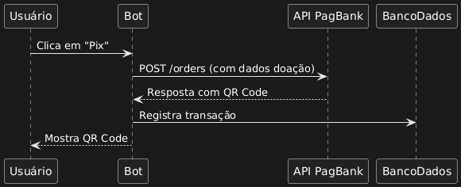

# 🤗 HugMe - Gerenciador de Apoios via PIX para Discord (Em Desenvolvimento)
**HugMe** é um projeto em desenvolvimento que visa integrar o sistema de doações mensais via **PIX** a um servidor Discord da comunidade autista. Através de um bot, o sistema atribui automaticamente cargos especiais no Discord aos apoiadores com base em seu status de contribuição \:D.

## 📌 Descrição
O HugMe é uma aplicação backend escrita em **Python**, que oferece:
- Integração com comprovantes de doação via **PIX** para gerenciamento de apoios.
- Persistência das informações de apoiadores e doações em um banco **PostgreSQL**.
- Automatização da atribuição de cargos no Discord com base no tempo e nível de apoio.
- Painel web administrativo (futuramente) para gerenciamento e visualização dos dados.

## 🚧 Status do Projeto
**Este projeto está em desenvolvimento ativo.**
### Funcionalidades concluídas:
- [X] Configuração inicial do ambiente Python com virtualenv.
- [X] Conexão com PostgreSQL configurada.
- [X] Configuração do SQLAlchemy ORM.
- [X] Sistema básico do discord.py (comandos/eventos).
- [X] Modelo de banco de dados para apoiadores.
- [X] Painel web administrativo (FastAPI + frontend).
- [X] Comandos básicos no Discord.
- [X] Sistema de verificação de tempo no servidor.
- [X] Atribuição de cargos via botão interativo.
- Integração com PIX: [███░░░░░░░] 30%
  - [x] Envio do PIX implementado
  - [ ] Validação do pagamento pendente
  - [ ] Cargos de Apoio Automáticos

### Funcionalidades em andamento:
- [ ] Tarefas agendadas para expiração de apoios.
- [ ] Refinamento do painel administrativo.

### Funcionalidades futuras:
- [ ] Sistema avançado de logs/alertas.
- [ ] Configuração de CI/CD.
- [ ] Dashboard de métricas para apoiadores.
- [ ] Sistema de notificações via webhook.

## 🧭 Próximos Passos
- [ ] Finalizar integração PIX (API de pagamentos)
- [ ] Implementar tasks agendadas para:
- [ ] Verificação de expiração
- [ ] Atualização de cargos
- [ ] Adicionar seção de logs no painel
- [ ] Documentar API para integrações externas

## 🛠 Tecnologias Utilizadas
- [Python 3.12+](https://www.python.org/)
- [discord.py](https://github.com/Rapptz/discord.py)
- [SQLAlchemy ORM](https://www.sqlalchemy.org/)
- [PostgreSQL](https://www.postgresql.org/)
- [asyncio](https://docs.python.org/3/library/asyncio.html)
- [Railway.app](https://railway.app/) *(planejado para banco de dados)*
- [Render](https://render.com/) *(planejado para hospedagem do bot)*
- [PagSeguro (PagBank)](https://pagseguro.uol.com.br/) *(integração em andamento)*

## 📬 Contato
Para dúvidas, sugestões ou feedbacks, entre em contato:
📧 **[hugmebotdev@gmail.com](mailto:hugmebotdev@gmail.com)**

---
> Projeto pessoal desenvolvido com fins de aprendizado e apoio à comunidade autista. 💙

## 🧱 Arquitetura do Projeto

### Diagramas de Fluxo
