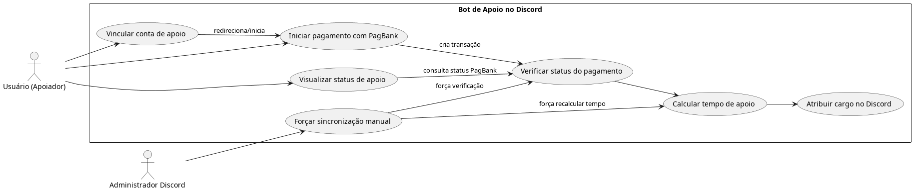

# 🤗 HugMe - Gerenciador de Apoios via PIX e Cartão para Discord (Em Desenvolvimento)

**HugMe** é um projeto em desenvolvimento que visa integrar o sistema de doações mensais via **PIX** e **Cartão de crédito/débito** a um servidor Discord da comunidade autista. Através de um bot, o sistema atribui automaticamente cargos especiais no Discord aos apoiadores com base em seu status de contribuição \:D.

## 📌 Descrição
O HugMe é uma aplicação backend escrita em **Python**, que oferece:
- Integração com comprovantes de doação via **PIX** e **cartão de crédito** para gerenciamento de apoios
- Persistência das informações de apoiadores e doações em um banco **PostgreSQL**
- Automatização da atribuição de cargos no Discord com base no tempo e nível de apoio
- Painel web administrativo (futuramente) para gerenciamento e visualização dos dados
- Suporte a pagamentos únicos e assinaturas recorrentes

## 🚧 Status do Projeto
**Este projeto está em Desenvolvimento:**
*migração de sistemas*

### Funcionalidades concluídas:
- [x] Configuração inicial do ambiente Python com virtualenv
- [x] Conexão com PostgreSQL configurada
- [x] Configuração do SQLAlchemy ORM
- [x] Sistema básico do discord.py (comandos/eventos)
- [x] Modelo de banco de dados para apoiadores
- [x] Comando `/doar` com interface interativa via botão e modal
- [x] Painel administrativo web básico
- [x] Autenticação via Discord OAuth2
- [x] Finalizar integração:
  - [x] Webhook de confirmação de PIX
  - [x] Sistema de assinaturas com cartão

### Integração [█████████░] **90%**
#### PIX via:
- [x] Configuração da API 
- [x] Geração de QR Code dinâmico
- [x] Sistema básico de webhooks
- [x] Validação completa de pagamento via webhook
  - [x] Envio do Webhook pro PagBank
  - [x] Recebimento de Confirmação 
- [ ] Atribuição automática de cargo
### Integração [█████████░] **90%**
#### Cartão de Crédito:
- [x] Implementação de assinaturas recorrentes (ko-fi)
- [x] Tokenização de cartões (ko-fi)
- [x] Sistema de renovação automática (ko-fi)
- [ ] Atribuição automática de cargo
### Funcionalidades em andamento:
- [ ] Tarefas agendadas para expiração de apoios
- [ ] Refinamento do painel administrativo
- [ ] Integração completa entre webhook e cargos

### Funcionalidades futuras:
- [ ] Sistema avançado de logs/alertas
- [ ] Configuração de CI/CD
- [ ] Dashboard de métricas para apoiadores
- [ ] Sistema de notificações via webhook

## 🧭 Próximos Passos
- [ ] Implementar agendamentos para:
  - [ ] Verificação de expiração
  - [ ] Atualização de cargos automaticamente
- [ ] Adicionar painel com histórico e logs
- [ ] Documentar API para integrações externas

## 🏁 Etapa Final
- [ ] Testes completos no ambiente real
- [ ] Migrar o bot para ambiente de produção

## 🛠 Tecnologias Utilizadas
- [Python 3.12+](https://www.python.org/)
- [discord.py](https://github.com/Rapptz/discord.py)
- [SQLAlchemy ORM](https://www.sqlalchemy.org/)
- [PostgreSQL](https://www.postgresql.org/)
- [FastAPI](https://fastapi.tiangolo.com/)
- [httpx](https://www.python-httpx.org/)
- [asyncio](https://docs.python.org/3/library/asyncio.html)
- [Railway](https://railway.app/) *(planejado para banco de dados)*
- [Render](https://render.com/) *(planejado para hospedagem do bot)*

## 📬 Contato
📧 **[hugmebotdev@gmail.com](mailto:hugmebotdev@gmail.com)**

---
> Projeto pessoal desenvolvido com fins de aprendizado e apoio à comunidade autista. 💙
---
## 🧱 Arquitetura do Projeto

> por algum motivo o diagrama não quer atualizar, ignore

## Diagramas de Fluxo

>esse tambem ;-;
