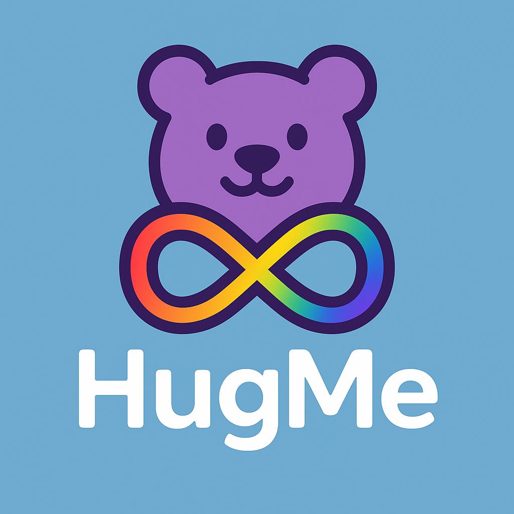

# HugMe - Bot de Doações e Apoio para Discord

> Um bot que ajuda comunidades a receberem apoio financeiro e recompensar quem contribui, com doações via PIX e Ko-fi, além de um sistema de RPG por texto para entretenimento.



## O que é o HugMe?

O **HugMe** é um bot para Discord que faz duas coisas principais:

### 1. Sistema de Doações

Quando alguém doa para a comunidade, o bot:

- **Recebe o pagamento** (via PIX ou cartão via Ko-fi)
- **Verifica se o pagamento foi confirmado**
- **Dá um cargo especial** no servidor automaticamente
- **Lembra de renovar** o cargo se for uma assinatura (Ko-fi)

### 2. Sistema de RPG

Um jogo de aventuras por texto onde:

- Você cria um personagem
- Vai vivendo histórias com ajuda de IA
- Pode ter até 3 personagens diferentes
- As histórias são salvas, então você pode continuar depois

---

## Como funciona?

### Para quem quer doar

1. Digite `/doar` no chat
2. Escolha se quer doar via PIX (único) ou Ko-fi (mensal)
3. Siga as instruções
4. O bot dá um cargo automaticamente quando o pagamento é confirmado
5. Se for Ko-fi, o cargo volta automaticamente todo mês (sem precisar fazer nada)

### Para quem quer jogar RPG

1. Digite `/rpg_personagem` e crie seu personagem
2. Digite `/rpg` e descreva o que quer fazer
3. A IA cria a história com base no que você faz
4. Seu progresso é salvo automaticamente

---

## Índice

- [O que é o HugMe?](#o-que-é-o-hugme)
- [Como funciona?](#como-funciona)
- [O que você ganha ao doar](#o-que-você-ganha-ao-doar)
- [Instalação e configuração](#instalação-e-configuração)
- [Comandos principais](#comandos-principais)
- [Como o sistema de cargos funciona](#como-o-sistema-de-cargos-funciona)
- [Sistema de RPG](#sistema-de-rpg)
- [Painel administrativo](#painel-administrativo)
- [Suporte e contato](#suporte-e-contato)


---

## O que você ganha ao doar?

### Cargos no servidor

- **Cargo básico**: Todos os apoiadores recebem um cargo especial
- **Cargos por tempo**: Quanto mais tempo apoia, melhores cargos:
  - 30 dias: "Apoiador Ativo"
  - 90 dias: "Apoiador Veterano"
  - 180 dias: "Apoiador Elite"
  - 1 ano+: "Apoiador Lendário"

### Benefícios extras

- Cargo visual no servidor
- Acesso a canais exclusivos (se configurado)
- Reconhecimento pela comunidade
- Cargo volta automaticamente se for assinatura Ko-fi

---

## Instalação e configuração

### O que precisa

- Um servidor Discord
- Um bot do Discord (criado no [Portal do Desenvolvedor](https://discord.com/developers/applications))
- Conta no Ko-fi (opcional, para assinaturas)
- Banco de dados (PostgreSQL ou MariaDB)

### Passos rápidos

1. Clone o projeto: `git clone https://github.com/AnthonyLuciano/HugMe-DiscordBot.git`
2. Crie um arquivo `.env` com as configurações (veja `.env.example`)
3. Instale as dependências: `pip install -r requirements.txt`
4. Execute: `python bot/main.py`

### Configuração básica

No arquivo `.env`, você precisa configurar:

- Token do seu bot do Discord
- URL do banco de dados
- Token do Ko-fi (se for usar assinaturas)
- IDs dos cargos que quer usar no servidor

---

## Comandos principais

### Para todos os usuários

| Comando | O que faz |
|---------|-----------|
| `/doar` | Inicia o processo de doação |
| `/check` | Verifica o status do bot |
| `/tempo` | Verifica quanto tempo você está no servidor |
| `/rpg_personagem` | Cria um personagem para o RPG |
| `/rpg` | Interage com a aventura |
| `/rpg_status` | Verifica seu progresso no RPG |

### Para administradores

| Comando | O que faz |
|---------|-----------|
| `/set_qrcode` | Atualiza o QR Code do PIX |
| `/verificarcargo` | Cria botão para verificar cargos |
| `/weekly_check_now` | Força a checagem de cargos (normalmente roda sozinho) |

---

## Como o sistema de cargos funciona?

### O ciclo automático

```
1. Alguém doa → Bot dá cargo
2. Tempo passa → Bot verifica se a assinatura continua
3. Se continuar → Bot dá cargo de novo (renovação automática)
4. Se parar → Bot retira o cargo
```

### O que o bot faz automaticamente

- **A cada 6 horas**: Verifica quem está perto de expirar
- **A cada 12 horas**: Reativa quem renovou a assinatura
- **A cada 2 horas**: Dá o cargo de volta para quem renovou
- **Toda segunda-feira**: Recalcula todos os cargos baseados no tempo total

### Para o usuário

- **PIX**: Cargo dado uma vez (não expira)
- **Ko-fi**: Cargo volta automaticamente todo mês (sem precisar fazer nada)

---

## Sistema de RPG

### Como criar um personagem

1. Digite `/rpg_personagem`
2. Escolha nome, classe e raça
3. Distribua pontos nos 6 atributos (força, destreza, etc)
4. Pronto! Você pode começar a jogar

### Como jogar

1. Digite `/rpg` seguido do que quer fazer
2. A IA descreve o que acontece
3. Você pode continuar a história com mais comandos
4. Seu progresso é salvo automaticamente

### Limites

- Até 3 personagens por pessoa
- Histórico mantém as últimas 8 interações
- Funciona em canais públicos ou mensagem privada

---

## Painel administrativo

### O que é

Um site onde os administradores podem:

- Ver quem está apoiando
- Ver métricas de doações
- Gerenciar o servidor
- Acessar dados em tempo real

### Como acessar

1. Entre no site do painel
2. Clique em "Login com Discord"
3. Se for administrador, terá acesso total

---

## Suporte e contato

- **Problemas com o bot?** Abra uma issue no GitHub
- **Dúvidas gerais?** Entre no servidor da comunidade
- **Quer contribuir?** Veja o arquivo `CONTRIBUTING.md` (em breve)

---

## Licença

Este projeto é open-source e está sob a licença MIT. Isso significa que você pode usar, modificar e distribuir o código livremente, desde que mantenha a licença original.

---

**Feito com carinho para a comunidade Discord**
